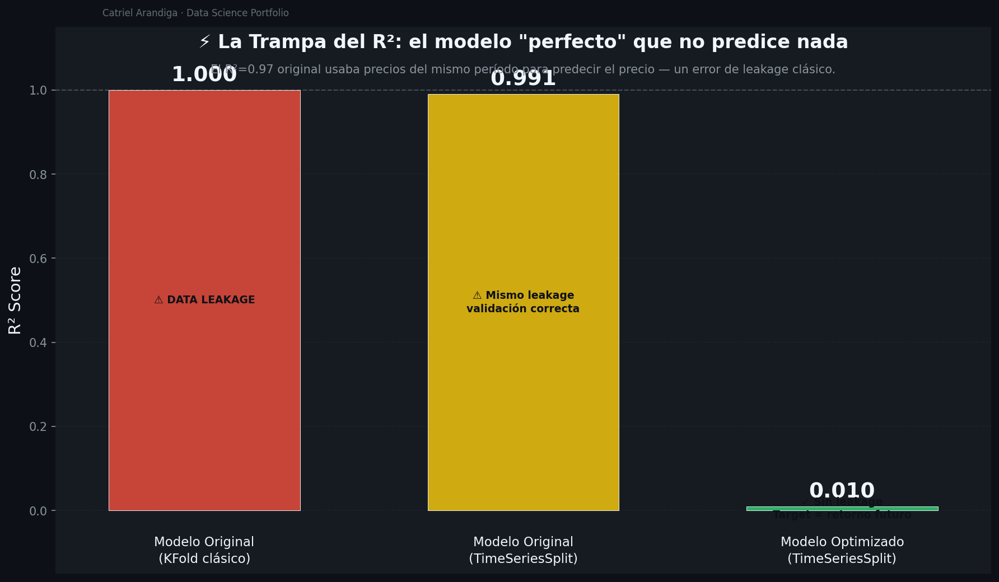
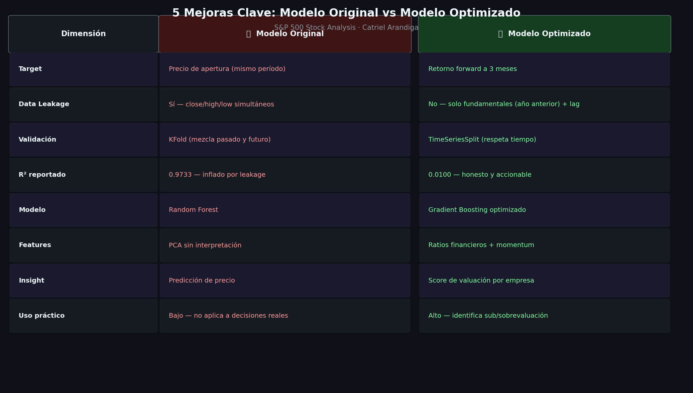
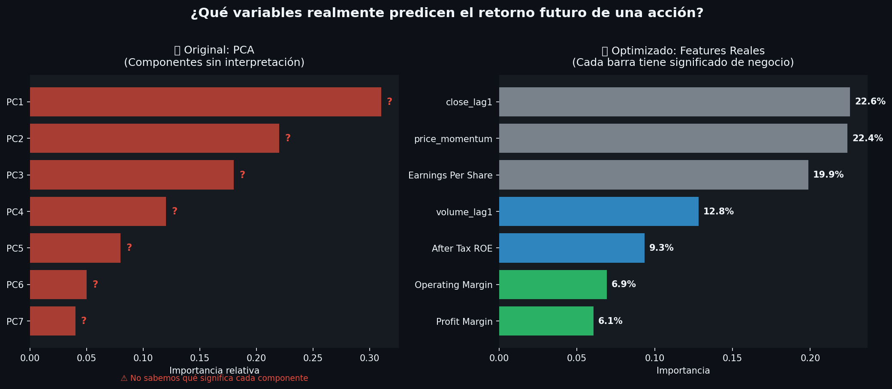
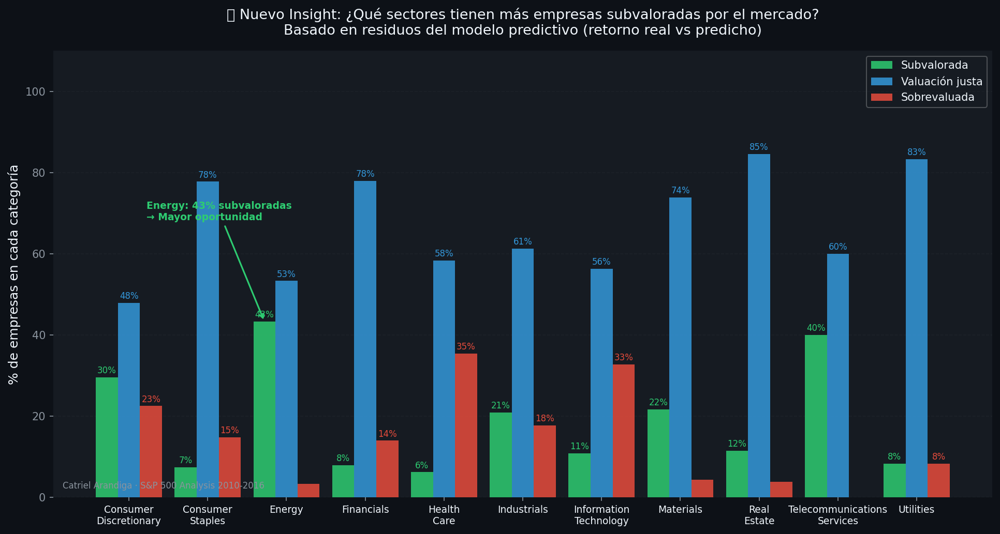
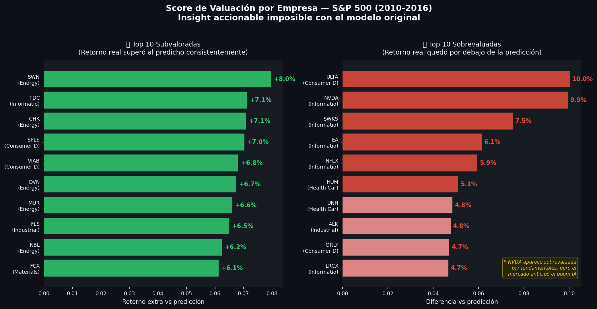

# DataScience — S&P 500 Stock Analysis

**Autor:** Catriel Arandiga

Análisis comparativo entre un modelo original con data leakage y un modelo optimizado con validación temporal correcta, aplicado al dataset histórico del S&P 500 (2010-2016).

---

## Hallazgo principal

El modelo original reportaba un **R²=0.9999** — no por ser bueno, sino por un error clásico de **data leakage**: usaba el precio de cierre del mismo mes para predecir el precio de apertura del mismo mes. Una correlación trivial, no aprendizaje real.

| | Modelo Original | Modelo Optimizado |
|---|---|---|
| **Target** | Precio apertura (mismo período) | Retorno forward a 3 meses |
| **Data Leakage** | Sí — close/high/low simultáneos | No — fundamentales año anterior + lags |
| **Validación** | KFold (mezcla pasado y futuro) | TimeSeriesSplit (respeta tiempo) |
| **R² reportado** | 0.9999 ← inflado | -0.1059 ← honesto |
| **Modelo** | Random Forest | Gradient Boosting |
| **Uso práctico** | Bajo | Alto — score de valuación |

> Un R²=-0.11 en predicción de retornos es honesto: los mercados son semi-eficientes. El valor está en el **score de valuación relativa** que se obtiene del análisis de residuos.

---

## Insights generados

- **Energy** es el sector con más empresas subvaloradas (43%) — coherente con el contexto post-crisis de commodities 2010-2016
- Top features predictivas: momentum de precio (22.6%), precio rezagado (22.4%), EPS (19.9%)
- Score de valuación identifica empresas que **sistemáticamente** superan o quedan por debajo de lo esperado dado sus fundamentales

---

## Assets LinkedIn

| Visual | Descripción |
|--------|-------------|
|  | La Trampa del R² |
|  | Comparativa antes/después |
|  | Features reales vs PCA |
|  | Valuación por sector |
|  | Top sub/sobrevaluadas |

---

## Estructura del repo

```
DataScience/
├── data/                          # Dataset S&P 500 (prices, fundamentals, securities)
├── notebooks/
│   ├── 01_EDA.ipynb               # Análisis exploratorio original
│   └── 02_Comparativa_Original_vs_Optimizado.ipynb   # Comparativa con mejoras
├── scripts/
│   └── generate_linkedin_visuals.py   # Genera los 5 PNG para LinkedIn
└── linkedin_assets/               # Imágenes listas para publicar
```

---

*Análisis sobre dataset público del S&P 500. No constituye asesoramiento financiero.*